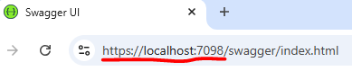
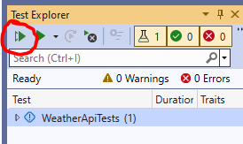
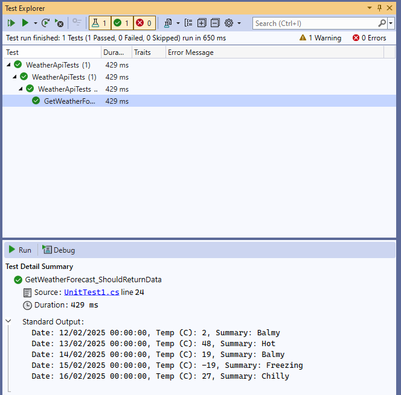
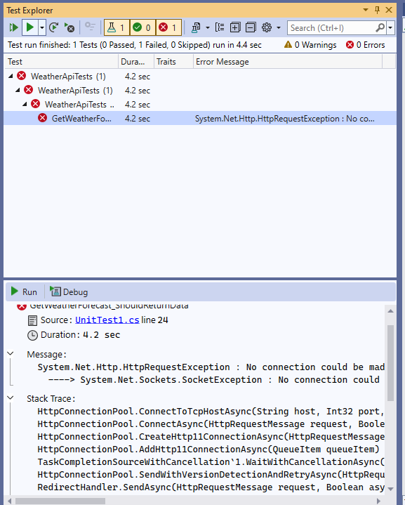
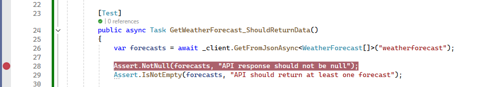
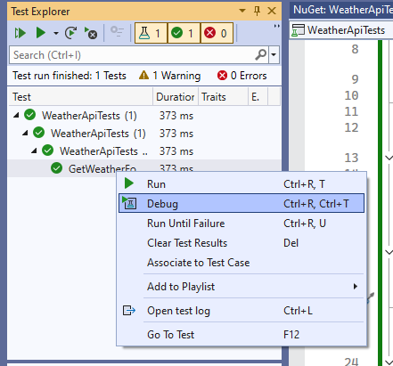
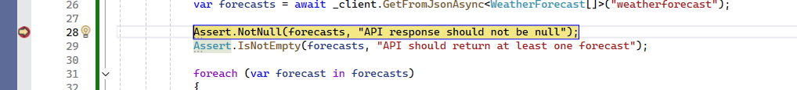
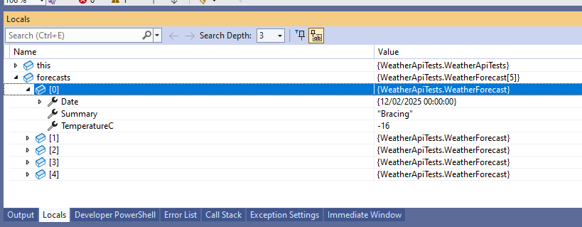

# Let's Test

Testing your .NET Web API's weather endpoint can be accomplished using tools like Bruno for API testing and by creating a C# application utilizing the `HttpClient` class. Let's look at both, with step-by-step instructions for both methods.

## **1. Testing with Bruno**

*Bruno* is an open-source IDE designed for exploring and testing APIs, serving as a lightweight alternative to tools like Postman.

### **Step 1: Install Bruno**

- **Windows**: Open PowerShell and run:
  ```powershell
  winget install Bruno.Bruno
  ```
- **macOS**: Use Homebrew:
  ```bash
  brew install bruno
  ```
- **Linux**: Use Snap:
  ```bash
  snap install bruno
  ```

For other installation methods, refer to Bruno's GitHub repository. 

### **Step 2: Launch Bruno**

After installation, open Bruno.

### **Step 3: Create a New Workspace and Collection**

- Click on **New Workspace** and provide a name.
- Within the workspace, create a **New Collection** to organize your API requests.

### **Step 4: Define the API Request**

- In your collection, add a new request:
  - Set the method to `GET`.
  - Enter your weather endpoint URL, e.g., `http://localhost:5000/weatherforecast`.

### **Step 5: Send the Request**

- Click the **Send** button to execute the request.
- Review the response to ensure the API is functioning as expected.

For a comprehensive guide, see the Bruno Tutorial for API Testing. citeturn0search10

## **2. Testing with a C# Application Using HttpClient**

Since this is a **testing project**, we'll create a **NUnit test project** and use `HttpClient` to verify the weather API.  

### **Step 1: Create a New NUnit Test Project**  

1. **Open Visual Studio**  
2. **Create a New Project**  
   - Select **"NUnit3 Test Project"**  
   - Click **"Next"**  
   - Name the project **`WeatherApiTests`**  
   - Click **"Create"**  

### **Step 2: Add Necessary Dependencies**  

1. In **Solution Explorer**, right-click on the **project** and select **"Manage NuGet Packages"**  
2. Go to the **"Browse"** tab and install:  
   - `System.Net.Http.Json`  
   - `Microsoft.NET.Test.Sdk` (if not already installed)  
   - `NUnit`   (if not already installed)  
   - `NUnit3TestAdapter`   (if not already installed)  

### **Step 3: Write the API Test**  

1. In **Solution Explorer**, open `UnitTest1.cs`  
2. Replace the contents with the following:  

```csharp
using System;
using System.Net.Http;
using System.Net.Http.Json;
using System.Threading.Tasks;
using NUnit.Framework;

namespace WeatherApiTests
{
    public class WeatherForecast
    {
        public DateTime Date { get; set; }
        public int TemperatureC { get; set; }
        public string Summary { get; set; }
    }

    [TestFixture]
    public class WeatherApiTests
    {
        private HttpClient _client;

        [SetUp]
        public void Setup()
        {
            _client = new HttpClient { BaseAddress = new Uri("http://localhost:5000/") }; //replace this with the correct url
        }

        [Test]
        public async Task GetWeatherForecast_ShouldReturnData()
        {
            var forecasts = await _client.GetFromJsonAsync<WeatherForecast[]>("weatherforecast");

            Assert.NotNull(forecasts, "API response should not be null");
            Assert.IsNotEmpty(forecasts, "API should return at least one forecast");

            foreach (var forecast in forecasts)
            {
                Console.WriteLine($"Date: {forecast.Date}, Temp (C): {forecast.TemperatureC}, Summary: {forecast.Summary}");
                Assert.IsNotNull(forecast.Summary, "Summary should not be null");
            }
        }

        [TearDown]
        public void TearDown()
        {
            _client.Dispose();
        }
    }
}
```

> :exclamation: Don't forget to update the URL to whatever the URL is of the running WeatherApi. You can see it when it opens in the browser: 



---

### **Explanation of NUnit Attributes Used in the Test**  

Attributes are also known as *decorators*. For now, all you need to know is that they provide a way for NUnit (the Test Runner) to know what each method does.

Attributes are identified by being enclosed in square brackets, e.g. `[Attribute]`.

#### **1. `[TestFixture]`**  
- This **marks the class** as a test suite in NUnit.  
- NUnit will **look for test methods** inside any class with `[TestFixture]`.  
    - *Without this attribute, NUnit may not recognize the class as a test contain*er.  

#### **2. `[SetUp]`**  
- This **marks a method that runs before each test**.  
- It's commonly used to **initialize resources** (e.g., `HttpClient`, database connections, test data).  
- In this case, we create an `HttpClient` instance **before each test** to ensure a fresh request.  

#### **3. `[Test]`**  
- This **marks a method as a Test Case**.  
- NUnit automatically detects and executes methods with `[Test]`.  
- In the example, `GetWeatherForecast_ShouldReturnData` is a test case that verifies the API response.  

#### **4. `[TearDown]`**  
- This **marks a method that runs after each test**.  
- It's used to **clean up resources** (e.g., closing database connections, disposing of objects).  
- In this case, `_client.Dispose();` ensures we properly release the `HttpClient` instance after each test.  We don't want open instances hanging around.

#### **Execution Flow of the Test**  
For each test method:  
1. **`[SetUp]` runs first** → Initializes `HttpClient`.  
2. **`[Test]` runs** → Makes a request to the API and performs assertions.  
3. **`[TearDown]` runs last** → Cleans up `HttpClient`.  

This ensures **isolation between tests** and avoids shared state issues.

---

### **Step 4: Run the Test**  

1. Open **Test Explorer**  
   - **View → Test Explorer**  
2. Click **Run All**  



3. The test should pass if the API is running correctly!

You can click through the test and see the results:



And if your API is not running, or you have used the wrong URL, you'll see something like:



---

## HttpClient?

More generally, an **HTTP client** is a software component or tool that **sends requests to web servers** and processes their responses over the **Hypertext Transfer Protocol (HTTP)**. It acts as a bridge between a client application and a web service, allowing the application to **retrieve data (GET requests), send data (POST requests), update resources (PUT/PATCH), or delete data (DELETE requests)**. An HTTP client typically handles tasks like **establishing connections, formatting requests, managing headers, handling authentication, and parsing responses**. It can be implemented in various programming languages and can take different forms, such as a **command-line tool (e.g., `curl`), a web browser, or a dedicated library (e.g., JavaScript's `fetch`)**.

Here, `HttpClient` is a **built-in .NET class** used to send HTTP requests and receive responses from web APIs or web services. `HttpClient` can handle various HTTP methods (`GET`, `POST`, `PUT`, `DELETE`), manage headers, query parameters, and authentication. 

## **Breakdown of `HttpClient` Usage in the Test**  

In our test, we use `HttpClient` to send a request to the API and retrieve data. The key line:  

```csharp
var forecasts = await _client.GetFromJsonAsync<WeatherForecast[]>("weatherforecast");
```

performs the API call and processes the response. 

But what the hell do all the parts mean? Well, let’s break it down step by step.  

---

### **1. `_client.GetFromJsonAsync<WeatherForecast[]>("weatherforecast")`**  

This line **sends an HTTP GET request** to the endpoint `"weatherforecast"` and automatically **deserializes the JSON response** into a C# array of `WeatherForecast` objects.  

---

### **2. `await` – Handling Asynchronous Execution**  

- `HttpClient` operations are **asynchronous** by default.  
- `await` ensures that the test **waits for the response** before proceeding.  
- This prevents blocking the main thread and improves performance.  

Without `await`, the test would move forward before the API request completes, likely causing errors.  

---

### **3. `GetFromJsonAsync<T>` – What It Does**  

- `GetFromJsonAsync<T>` is an **extension method** from `System.Net.Http.Json`.  
- It **automatically handles the deserialization** of the response body into the specified type (`WeatherForecast[]`).  
- It **expects a valid JSON response** from the API.  

**Alternative:** If we used `GetStringAsync` instead, we would have to manually parse the JSON:  

```csharp
var jsonString = await _client.GetStringAsync("weatherforecast");
var forecasts = JsonSerializer.Deserialize<WeatherForecast[]>(jsonString);
```

Using `GetFromJsonAsync<T>` **eliminates the need for manual JSON deserialization**.  

---

### **4. `"weatherforecast"` – The API Endpoint**  

- Since `_client.BaseAddress` is **set to** `"http://localhost:5000/"`,  
- `"weatherforecast"` is a **relative URL**,  
- The final request URL becomes:  
  ```
  http://localhost:5000/weatherforecast
  ```
- `HttpClient` automatically appends the **relative path** to the `BaseAddress`.  

---

### **5. Storing the Response in `forecasts`**  

- If the API request **succeeds**, the response is **converted into an array of `WeatherForecast` objects`**.  
- If the API **returns an error (e.g., 404, 500)**, an `HttpRequestException` is thrown.  
- If the response **is empty or malformed**, `forecasts` will be `null`.  

---

### **Summary**  

- **`HttpClient` sends a GET request** to `"http://localhost:5000/weatherforecast"`.  
- **`GetFromJsonAsync<T>`** fetches and **deserializes the response** into `WeatherForecast[]`.  
- **`await` ensures the request completes** before the test continues.  
- The test then **asserts that the response contains valid data**.  

---

## Debugging

Debugging in C# is probably an entire other post, however let's do some very basic things here.

When running your tests, you can run them in *debug* mode. This allows you to insert *breakpoints* and *inspect the variables* at runtime. This is really powerful. Let's look at an example of how we can see what we get back as a response from the API.

The breakpoint is where the code will pause executing.

### Add a Breakpoint

Let's add a breakpoint to our test:



> You click in the left-hand grey column to add a breakpoint, which is shown as a red circle.

### Run Debug

Now we run our test in Debug mode. There are *many* ways to do this, but executing a single test can be done by right clicking on it in the Test Explorer window and selecting `Debug`:



You'll see the test pauses: 



Now, you can inspect the value of the variable `forecasts` in the `Local` window at the bottom of the screen:



This is very useful when debugging and checking what is actually coming back from the API.

> Yes, this is the most simple debugging, but we all start somewhere. Let's not over-complicate it just yet!

To continue debugging, press `F5` or click the `Continue` button in the toolbar. The test will continue to execute and, hopefully, pass.

---

Now we have an **automated API test** using NUnit and `HttpClient`. We could even make it part of our CI pipeline.

Admittedly, this is only a *happy path* test. We haven't really checked much. But we do have an automated test that executes an HTTP request to a specified endpoint of a running API!

