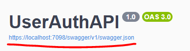
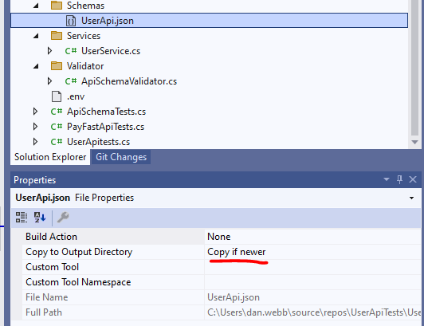
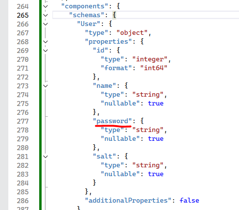
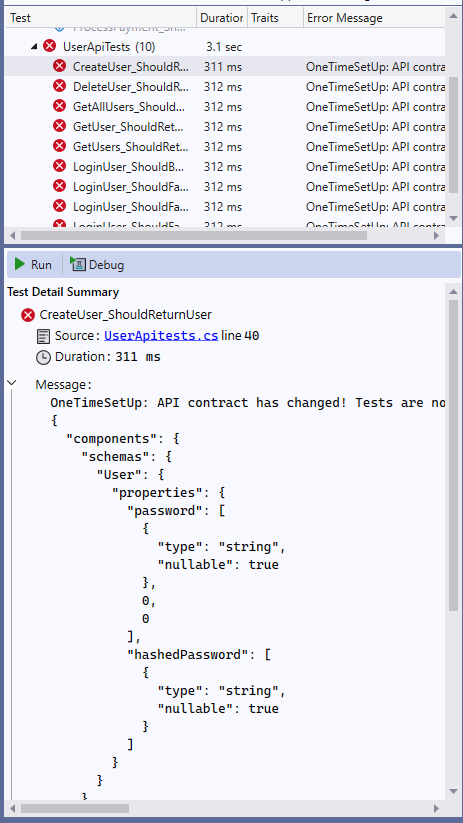

# Contract Testing

Using third-party APIs comes with some headaches. Often they change without your knowledge, tests break, and you don't know why. Sometimes this happens with our own API that we are testing!

There are other technologies out there for contract testing (like Pact), but we're going to test directly against the published OpenAPI spec from our `UserAuthApi` solution.

## Automating Schema Contract Validation for Third-Party APIs in C#

In this section, we will explore how you can use **RestSharp**, **Shouldly**, and **NUnit** in C# to achieve this. Specifically, we will build a system that:

1. Fetches the current schema from the third-party API (assuming it publishes a contract, such as a Swagger or OpenAPI spec).
2. Compares the retrieved schema with the locally stored version.
3. Prevents the tests from running if there is a schema change.

### Step 1: Define the Schema Comparison Logic

Install **JsonDiffPatchDotNet** from Nuget.

Let’s start by writing a class to fetch and compare the schemas. Create a new folder `Validator` and in it a class named `ApiSchemaValidator`.

```csharp
using JsonDiffPatchDotNet;
using Newtonsoft.Json.Linq;
using RestSharp;
using UserApiTests.Helpers;

namespace UserApiTests.Validator
{
    public class ApiSchemaValidator
    {
        private readonly string _schemaFilePath;
        private readonly string _apiContractUrl;

        public ApiSchemaValidator(string schemaFilePath, string apiContractUrl)
        {
            _schemaFilePath = schemaFilePath;
            _apiContractUrl = apiContractUrl;
        }

        public void ValidateSchema()
        {
            // Fetch the current schema from the third-party API
            var currentSchema = FetchSchemaFromApi();

            // Load the previously stored schema (your local version)
            var storedSchema = LoadStoredSchema();

            // Compare schemas
            var schemasAreEqual = SchemasMatch(currentSchema, storedSchema);

            if (!schemasAreEqual)
            {
                Assert.Fail("API contract has changed! Tests are not running.\r\n" + CompareSchemas(currentSchema, storedSchema));
            }
        }

        private JObject FetchSchemaFromApi()
        {
            var options = new RestClientOptions(_apiContractUrl);
            var client = new RestClient(options);
            var request = new RestRequest(ApiRoutes.Swagger);

            var response = client.Execute(request);

            if (response.IsSuccessful)
            {
                return JObject.Parse(response.Content); // Assuming it's a JSON response
            }

            throw new Exception("Failed to fetch API schema from the third-party service.");
        }

        private JObject LoadStoredSchema()
        {
            if (!File.Exists(_schemaFilePath))
            {
                throw new FileNotFoundException($"Schema file not found at path: {_schemaFilePath}");
            }

            var schemaJson = File.ReadAllText(_schemaFilePath);
            return JObject.Parse(schemaJson);
        }

        private bool SchemasMatch(JObject currentSchema, JObject storedSchema)
        {
            // A very basic comparison: In real scenarios, you'd need a more thorough comparison
            return JToken.DeepEquals(currentSchema, storedSchema);
        }

        private string CompareSchemas(JObject currentSchema, JObject storedSchema)
        {
            return new JsonDiffPatch().Diff(storedSchema, currentSchema).ToString();
        }

    }
}
```

### Step 2: Get The Current JSON

1. Run the `UserAuthApi` project
2. Click on the link to the JSON file:



3. Copy the JSON to the clipboard
4. Create a new folder named `Schemas`
5. Create a JSON file named `UserApi.json`
6. Paste the JSON into the file and save it
7. Change the properties for `Copy to Output Directory` to `Copy if newer`:



### Step 3: Updating NUnit Tests

Now let’s use this validation. The idea is that before running any tests, we validate the schema contract to ensure it hasn’t changed unexpectedly.

Add the following to you `UserApitest.cs` file, before the first `[Setup]`:

```csharp
[OneTimeSetUp]
public void OneTimeSetUp()
{
    var schemaFilePath = "Schemas/UserApi.json"; 
    var apiContractUrl = "https://localhost:7098/"; 
    var schemaValidator = new ApiSchemaValidator(schemaFilePath, apiContractUrl);

    schemaValidator.ValidateSchema();
}
```

### Step 4: Update Your Schema File

Update your `UserApi.json` for the `User` object from `hashedPassword` to just `password`:



### Step 5: Running Tests

When you run the tests, the validation will occur first, ensuring the third-party API schema hasn’t changed unexpectedly and no test will run:



## Finally 

By automating the schema validation, we ensure that any breaking changes in the third-party API contracts are detected **early**. This provides us a safeguard for our automated tests and reduces the risk of unexpected test failures due to external changes. 

---

# That's All For Now
