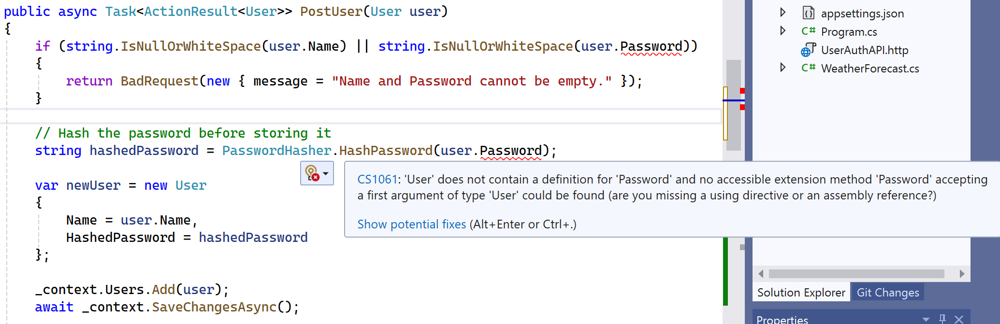

# Securing The Data

## **Part 1: Understanding Hashing for Password Security**  

### **Why Hash Passwords?**  
Storing passwords in plain text like we have done is a security risk. If an attacker gains access to the database, they can immediately see all user passwords. Instead, we use **hashing** to transform passwords into a secure, irreversible format.

---

## **What is Hashing?**  
Hashing is a one-way process that converts an input (e.g., a password) into a fixed-length string of characters. The same input **always** produces the same output, but you **cannot reverse** the hash to get the original password.  

### **Example of SHA256 Hashing Code**

```csharp
    static string HashPassword(string password)
    {
        using (SHA256 sha256 = SHA256.Create())
        {
            byte[] bytes = Encoding.UTF8.GetBytes(password);
            byte[] hash = sha256.ComputeHash(bytes);

            return Convert.ToBase64String(hash);
        }
    }
```

### **Example Output**
```
Original Password: MySecurePassword
Hashed Password: xMsbACr6x1yxwS7RmB0WqIdXyoUj5gHkk9vy7REbFS8=
```

# **Updating the API to Hash Passwords Before Storing**  

Now that we understand hashing, let's update the `UserAuthAPI` to store **hashed passwords** instead of plain text.  

---

## **Step 1: Update the User Model**  

Since we only need the hashed password, we'll rename `Password` to `HashedPassword` to avoid confusion:  

```csharp
namespace UserAuthAPI.Models
{
    public class User
{
    public long Id { get; set; }
    public string Name { get; set; }
    //public string Password { get; set; }
    public string HashedPassword { get; set; } // Added renamed field for clarity
}
}
```

---

## **Step 2: Create a Password Hashing Method**  

We'll use **SHA256** for now. In **Part 2**, we’ll improve security by adding salting.  

First, create a new folder named `Helpers` and add a new class `PasswordHasher.cs`:

```csharp
using System.Security.Cryptography;
using System.Text;

public static class PasswordHasher
{
    public static string HashPassword(string password)
    {
        using (SHA256 sha256 = SHA256.Create())
        {
            byte[] bytes = Encoding.UTF8.GetBytes(password);
            byte[] hash = sha256.ComputeHash(bytes);

            return Convert.ToBase64String(hash);
        }
    }
}
```

---

## **Step 3: Update the Controller to Hash Passwords**  

Modify `PostUser.cs` so that passwords are hashed before saving.  

```csharp
[HttpPost]
public async Task<ActionResult<User>> PostUser(User user)
{
    if (string.IsNullOrWhiteSpace(user.Name) || string.IsNullOrWhiteSpace(user.Password))
    {
        return BadRequest(new { message = "Name and Password cannot be empty." });
    }

    // Hash the password before storing it
    string hashedPassword = PasswordHasher.HashPassword(user.Password);
    
    var newUser = new User
    {
        Name = user.Name,
        HashedPassword = hashedPassword
    };

    _context.Users.Add(newUser);
    await _context.SaveChangesAsync();

    return CreatedAtAction(nameof(GetUser), new { id = newUser.Id }, newUser);
}
```

> :exclamation: There will be errors with this, I'll explain shortly, don't worry!

### Errors!

You should see something like this:



That's because we have updated our `User` class to have a `HashedPassword` field, but we're expecting a `Password` field to be passed in from the call.


We're going to have to have two classes, one for input from outside, and one we use internally.

---

# **Introducing DTOs: Separating User Input from Stored Data**  

We need to make an important architectural change. Right now, our API exposes the **User** model directly, but this causes two issues:  

1. **Security Risk** – We don’t want to expose the stored hashed password in API responses.  
2. **Better Abstraction** – The API should accept a **User DTO** (Data Transfer Object) with plain text `Password`, but store a separate **User entity** with `HashedPassword`.  

---

## **Step 1: Create DTOs (Data Transfer Objects)**  

### **User DTO (for input/output)**  

This represents what the API receives from a client when registering a user. Create the class `UserDto.cs` in the `Models` folder. 

```csharp
namespace UserAuthAPI.DTOs
{
    public class UserDto
    {
        public string Name { get; set; }
        public string Password { get; set; } // this is plain text, only used for input
    }
}
```

---

### **User Entity (for internal storage)**  

This is what we store in the database. It does **not** expose passwords.  

> Our `User.cs` class now doesn't need to change:

```csharp
namespace UserAuthAPI.Models
{
    public class User
    {
        public long Id { get; set; }
        public string Name { get; set; }
        public string HashedPassword { get; set; } 
    }
}
```

---

## **Step 2: Update the Controller to Use DTOs**  

Modify `PostUser` to take a `UserDto` instead of `User`, hash the password, and store it safely.  

```csharp
[HttpPost]
public async Task<ActionResult<User>> PostUser(UserDto user)
{
    if (string.IsNullOrWhiteSpace(user.Name) || string.IsNullOrWhiteSpace(user.Password))
    {
        return BadRequest(new { message = "Name and Password cannot be empty." });
    }

    // Hash the password before storing it
    string hashedPassword = PasswordHasher.HashPassword(user.Password);

    var newUser = new User
    {
        Name = user.Name,
        HashedPassword = hashedPassword
    };

    _context.Users.Add(newUser);
    await _context.SaveChangesAsync();

    
    return CreatedAtAction(nameof(GetUser), new { id = newUser.Id }, newUser);
}
```

## **Step 3: Verify the Change**  

> :exclamation: Comment out the Login method in the controller - we'll update it in a second!

Try creating a new user with:  

```json
{
    "name": "Alice",
    "password": "SecurePass123"
}
```

The response should return a hashed password:  

```json
{
    "id": 1,
    "name": "Alice",
    "hashedPassword": "xMsbACr6x1yxwS7RmB0WqIdXyoUj5gHkk9vy7REbFS8="
}
```

---

## **Why This Matters**  

- The **DTO (UserDto)** ensures that clients **never see the hashed password**.  
- The **entity (User)** keeps hashed passwords secure inside the database.  
- Now, in the API (e.g., login, updating user details), we can use different **DTOs** for different cases without exposing sensitive data.  

---

# Why Return the Hashed Password?

Returning the hashed password in the response is a **security risk**—it exposes sensitive information that should never leave the backend.  

We'll fix that by modifying our endpoint to return only safe information.

---

## **Remove the Hashed Password from API Responses**  

### **Before (Security Issue)**  
```csharp
return CreatedAtAction(nameof(GetUser), new { id = newUser.Id }, newUser);
```
This leaks `HashedPassword` in the response body.

---

### **After (Security Fix)**  
We only return **safe, non-sensitive data**:  

```csharp
return CreatedAtAction(nameof(GetUser), new { id = newUser.Id }, new { id = newUser.Id, name = newUser.Name });
```

Now, the response will look like this:  

```json
{
    "id": 1,
    "name": "Alice"
}
```

---

### **Why Is This Important?**  

**Prevent data leaks** – Hashed passwords should never be exposed, even if they're not reversible.  
**Follow best practices** – Most APIs return minimal user details, never sensitive data.  
**Easier to extend** – If we need to return more user details later, we can design a dedicated **response DTO**.  

---


## Login

Right now, our `Login` method in the controller wont work. We need a way to verify the plaintext password passed to us, is the same as the *hashed* password we have in the database.

Update the `PasswordHasher.cs` file with a new method:

---

### **`VerifyPassword` Method**
```csharp
public static bool VerifyPassword(string enteredPassword, string storedHash)
{
    using (SHA256 sha256 = SHA256.Create())
    {
        byte[] bytes = Encoding.UTF8.GetBytes(enteredPassword);
        byte[] computedHash = sha256.ComputeHash(bytes);

        return Convert.ToBase64String(computedHash) == storedHash; // Compare hashes
    }
}
```

---

### **How It Works**  
1. The user enters a password during login.
2. The method hashes the entered password using SHA-256 (same as HashPassword).
3. It compares the computed hash to the one stored in the database.
4. If they match, the password is correct.

---

## Update `Login` Method

```csharp
[AllowAnonymous]
[HttpPost("login")]
public async Task<IActionResult> LoginUser(UserDto userDto)
{
    if (string.IsNullOrWhiteSpace(userDto.Name) || string.IsNullOrWhiteSpace(userDto.Password))
    {
        return BadRequest(new { message = "Name and/or Password cannot be empty." });
    }

    // Find user by name ONLY - yes, I know this means we could have users 
    //with the same name in the DB and it'd cause problems
    // - we'll deal with that later
    var user = _context.Users.SingleOrDefault(x => x.Name == userDto.Name);
    if (user == null)
    {
        return Unauthorized(new { message = "Invalid credentials" });
    }

     // Verify hashed password
    bool isPasswordValid = PasswordHasher.VerifyPassword(userDto.Password, user.HashedPassword);
    if (!isPasswordValid)
    {
        return Unauthorized(new { message = "Invalid credentials" });
    }

    var token = GenerateJwtToken(user);

    return Ok(new { token });
}
```

---

# **Next Steps: Salting for Better Security**  

Right now, if two users choose the same password, their hashed passwords will match. That’s a problem because it makes **rainbow table attacks** easier.  

## **Why Hashing Alone Isn't Enough**
While hashing protects passwords from direct exposure, **it has weaknesses**:
1. **Same password → same hash**  
   - If two users have the same password, their hashes will be identical.  
2. **Precomputed attacks (Rainbow Tables)**  
   - Hackers can use databases of precomputed hash values to crack weak passwords.  
3. **Fast brute-force attacks**  
   - Algorithms like SHA256 are designed to be fast, making brute-force attacks easier.

In **Part 2**, we’ll introduce **salting**, which ensures that even identical passwords result in different hashes. 

---

[>> Salting](./salting.md)
