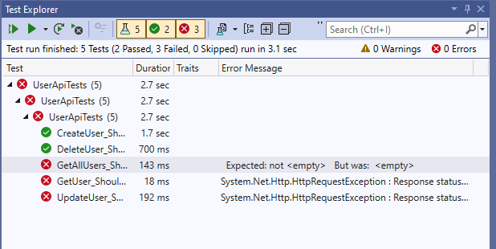
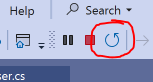
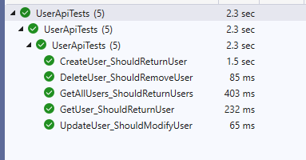

# CRUD Testing an API

This focuses on **happy-path testing** (successful scenarios only) for the **Users API** in a .NET 8 Web API using **NUnit and HttpClient**. 

Here's what we are going to do:  

1. **Set up an NUnit Test Project**  
2. **Write API tests** for:  
   - Adding a user (`POST /api/Users`)  
   - Retrieving all users (`GET /api/Users`)  
   - Updating a user (`PUT /api/Users/{id}`)  
   - Deleting a user (`DELETE /api/Users/{id}`)  

## **1. Create an NUnit Test Project**  

### **Step 1: Open Visual Studio and Create an NUnit Test Project**  
1. Open **Visual Studio**  
2. Select **"Create a new project"**  
3. Choose **"NUnit3 Test Project"**, then click **"Next"**  
4. Name the project **`UserApiTests`**, then click **"Create"**  

### **Step 2: Add Required Dependencies**  
1. **Right-click** the project in **Solution Explorer**  
2. Select **"Manage NuGet Packages"**  
3. Install the following packages:  
   - `System.Net.Http.Json`  
   - `Microsoft.NET.Test.Sdk` (if not already installed)  
   - `NUnit`   (if not already installed)  
   - `NUnit3TestAdapter`   (if not already installed)  

---

## **2. Define the User Model**  

Create a new folder `Models`. Inside this folder, create a new file **`User.cs`** inside the test project and add:  

```csharp
public class User
{
    public long Id { get; set; }
    public string Name { get; set; }
    public string Password { get; set; }
}
```

---

## **3. Write API Tests Using HttpClient**  

### **Step 1: Create a Test Class**  

In **Solution Explorer**, right-click `UnitTest1.cs` and rename it to **`UserApiTests.cs`**.  

Replace the contents with the following, replacing the localhost URL with whatever yours is:  

```csharp
using System;
using System.Net.Http;
using System.Net.Http.Json;
using System.Threading.Tasks;
using NUnit.Framework;

namespace UserApiTests
{
    [TestFixture]
    public class UserApiTests
    {
        private HttpClient _client;

        [SetUp]
        public void Setup()
        {
            _client = new HttpClient { BaseAddress = new Uri("https://localhost:5000/api/Users/") };  //replace URL with whatever your URL is
        }

        [Test]
        public async Task CreateUser_ShouldReturnUser()
        {
            var newUser = new User { Name = "John Doe", Password = "SecurePass123" };

            var response = await _client.PostAsJsonAsync("", newUser);
            response.EnsureSuccessStatusCode();

            var createdUser = await response.Content.ReadFromJsonAsync<User>();

            Assert.NotNull(createdUser);
            Assert.Greater(createdUser.Id, 0);
            Assert.That(createdUser.Name, Is.EqualTo(newUser.Name));
        }

        [Test]
        public async Task GetAllUsers_ShouldReturnUsers()
        {
            var response = await _client.GetAsync("");
            response.EnsureSuccessStatusCode();

            var users = await response.Content.ReadFromJsonAsync<User[]>();

            Assert.NotNull(users);
            Assert.IsNotEmpty(users);
        }

        [Test]
        public async Task GetUser_ShouldReturnUser()
        {
            var response = await _client.GetAsync("1");
            response.EnsureSuccessStatusCode();

            var user = await response.Content.ReadFromJsonAsync<User>();

            Assert.NotNull(user);
            Assert.That(user.Id, Is.EqualTo(1));
            Assert.That(user.Name, Is.EqualTo("John Doe"));
            Assert.That(user.Password, Is.EqualTo("SecurePass123"));
        }

        [Test]
        public async Task UpdateUser_ShouldModifyUser()
        {
            var updatedUser = new User { Id = 1, Name = "JohnDoeUpdated", Password = "NewPass123" };

            var response = await _client.PutAsJsonAsync("1", updatedUser);
            response.EnsureSuccessStatusCode();

            var getUserResponse = await _client.GetAsync("1");
            var fetchedUser = await getUserResponse.Content.ReadFromJsonAsync<User>();

            Assert.NotNull(fetchedUser);
            Assert.That(fetchedUser.Name, Is.EqualTo("JohnDoeUpdated"));
        }

        [Test]
        public async Task DeleteUser_ShouldRemoveUser()
        {
            var response = await _client.DeleteAsync("1");
            response.EnsureSuccessStatusCode();

            var getUserResponse = await _client.GetAsync("1");
            Assert.That(getUserResponse.StatusCode, Is.EqualTo(System.Net.HttpStatusCode.NotFound));
        }

        [TearDown]
        public void TearDown()
        {
            _client.Dispose();
        }
    }
}
```

> :exclamation: Remember that we are running against an in-memory application, which means that if it restarts it will have *zero* users in it. That makes these tests fragile, and dependent on each other to run in an **exact** order (for example, you have to add a user before you can edit or delete a user, otherwise your tests will fail). That is **bad**, but it's not the objective of this section.
>
> More advanced topics will cover how we'd make these tests *atomic* and be able to be run in any order.

---

## **4. Running the Tests**  

Restart the UserAuthAPI project before executing tests.

### **Step 1: Open Test Explorer**  
1. Go to **Test → Test Explorer** in Visual Studio  

### **Step 2: Run the Tests**  
1. Click **Run All**  

 You should notice 2 pass, and three fail:

 

Oh dear. This is because NUnit runs tests in *alphabetical order*. We first *create* a user, then *delete* a user, which means our test to *get* users fails as there are not users to get, none to edit and so on!

### **Step 3: Order Tests**

We can temporarily get around this by adding an `Order` attribute to our test, like so:


```cs
[Test, Order(1)]
public async Task CreateUser_ShouldReturnUser() 


[Test, Order(2)]
public async Task GetAllUsers_ShouldReturnUsers()

```

> :exclamation: You should already be feeling uneasy about having to do this. Don't worry, we're doing it on purpose.

### **Step 4: Run the Tests**  
1. Restart the `UserAuthAPI` project before executing tests:



2. Click **Run All** in the `UserApitTests` project 
3. Check all tests pass:



---

> :exclamation: Please remember, this tutorial **focuses on happy-path scenarios only**, ensuring the API performs correctly under expected conditions.

---

### **Next Steps: Labs & Exercises**  

Now that you've successfully tested the **happy-path CRUD operations** for the `Users` API, here are some hands-on labs and exercises to deepen your understanding of **API testing with NUnit and HttpClient**.  

---

## **Lab 1: Add Login Tests (`POST /api/Users/login`)**  
**Goal:** Write a test to verify the login functionality.  

### **Tasks:**  
1. Modify the `User` model to include login request/response handling if needed.  
2. Create a **test method** for `POST /api/Users/login` that:  
   - Sends a **valid username and password**.  
   - Asserts that the response is **successful** (e.g., contains a token or user details). 

   > You will probably need to *deserialize* the *response* to a *class*, look at UpdateUser tests for a pattern. And here's the class:
   ```cs
        internal class LoginResponse
        {
            public long Id { get; set; }
        }
   ```

3. Run the test and confirm that login works correctly.  

📌 **Bonus:** Try logging in with an **incorrect password** and observe the response.  

---

## **Lab 2: Validate User Data Before Making API Calls**  
**Goal:** Improve test reliability by validating test inputs.  

### **Tasks:**  
1. Update `UpdateUser_ShouldModifyUser` to check:  
   - The **user exists** before updating.  
   - The **ID is valid** before sending the request.  

📌 **Bonus:** Try sending a request with an **empty name** and check if the API rejects it properly.  

---

[>> Making Tests Independent](./atomicity.md)