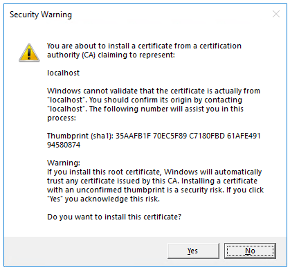
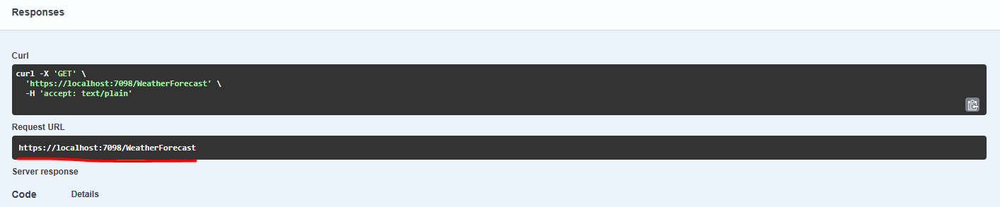
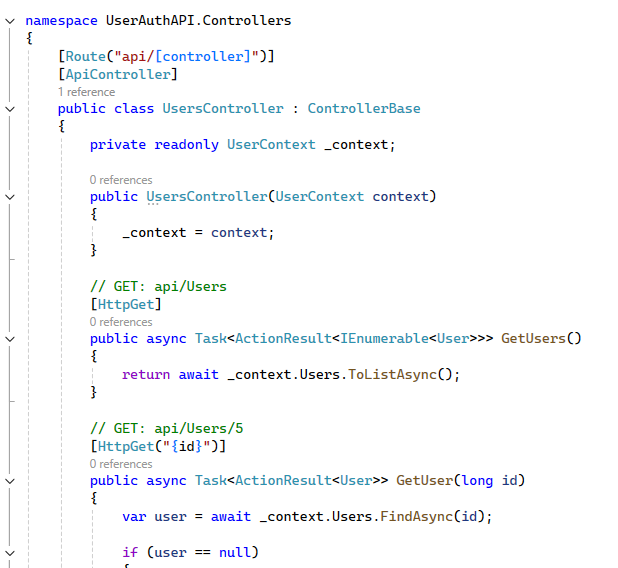
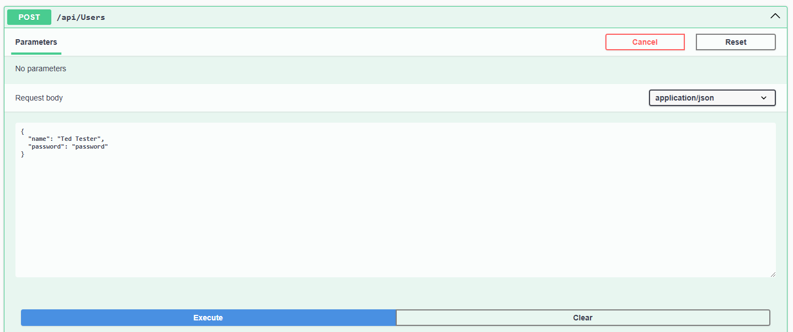
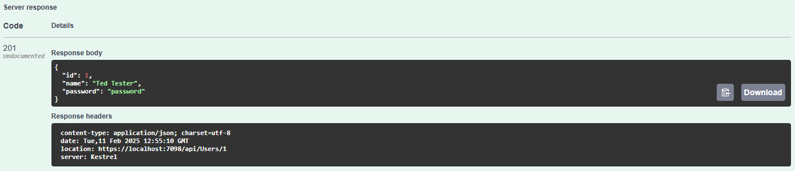
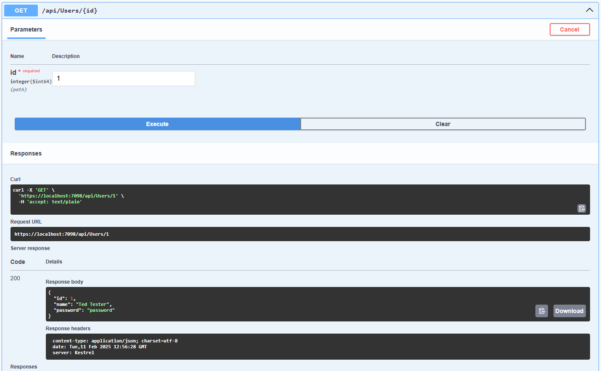
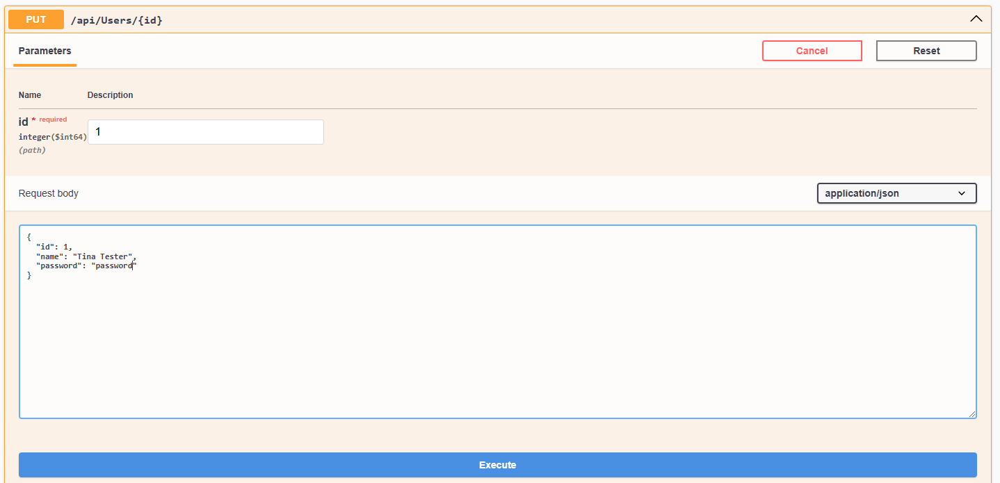
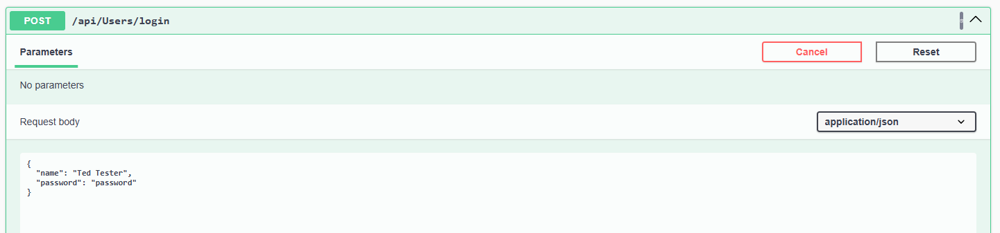
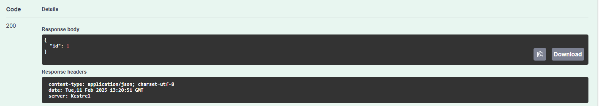

# Build Our API
We are going to build a small API in C# using .net 8 that will allow us to create add, delete, and update users, using an in-memory database.

## Starting Out

* From the File menu, select New > Project.
* Enter Web API in the search box.
* Select the ASP.NET Core Web API template and select Next.
* In the Configure your new project dialog, name the project *UserAuthAPI* and select Next.
* In the Additional information dialog:
    * Confirm the Framework is .NET 8.0 (Long Term Support).
    * Confirm the checkbox for Use controllers is checked.
    * Confirm the checkbox for Enable OpenAPI support is checked.
    * Select Create.

## Add a NuGet package
A NuGet package must be added to support the database used in this tutorial.

From the Tools menu, select **NuGet Package Manager > Manage NuGet Packages** for Solution.
* Select the Browse tab.
* Enter **Microsoft.EntityFrameworkCore.InMemory** in the search box, and then select Microsoft.EntityFrameworkCore.InMemory.
* Select the **Project** checkbox in the right pane and then select Install.

## Test the project
The project template creates a WeatherForecast API with support for Swagger.

Visual Studio
Press Ctrl+F5 to run without the debugger.

Visual Studio displays the following dialog when a project is not yet configured to use SSL:


Select Yes if you trust the IIS Express SSL certificate.

The following dialog is displayed:



Security warning dialog

Select **Yes** if you agree to trust the development certificate.

For information on trusting the Firefox browser, see Firefox SEC_ERROR_INADEQUATE_KEY_USAGE certificate error.

Visual Studio launches the default browser and navigates to `https://localhost:<port>/swagger/index.html`, where `<port>` is a randomly chosen port number set at the project creation.

The Swagger page `/swagger/index.html` is displayed. Select **GET > Try it out > Execute**. The page displays:

* The Curl command to test the WeatherForecast API.
* The URL to test the WeatherForecast API.
* The response code, body, and headers.
* A drop-down list box with media types and the example value and schema.

If the Swagger page doesn't appear, see [this GitHub issue](https://github.com/dotnet/AspNetCore.Docs/issues/21647).

Swagger is used to generate useful documentation and help pages for web APIs. This tutorial uses Swagger to test the app. For more information on Swagger, see [ASP.NET Core web API documentation with Swagger / OpenAPI](https://learn.microsoft.com/en-us/aspnet/core/tutorials/web-api-help-pages-using-swagger?view=aspnetcore-9.0).

Copy and paste the Request URL in the browser: `https://localhost:<port>/weatherforecast`, eg: 



JSON similar to the following example is returned:

```json
[
    {
        "date": "2019-07-16T19:04:05.7257911-06:00",
        "temperatureC": 52,
        "temperatureF": 125,
        "summary": "Mild"
    },
    {
        "date": "2019-07-17T19:04:05.7258461-06:00",
        "temperatureC": 36,
        "temperatureF": 96,
        "summary": "Warm"
    },
    {
        "date": "2019-07-18T19:04:05.7258467-06:00",
        "temperatureC": 39,
        "temperatureF": 102,
        "summary": "Cool"
    },
    {
        "date": "2019-07-19T19:04:05.7258471-06:00",
        "temperatureC": 10,
        "temperatureF": 49,
        "summary": "Bracing"
    },
    {
        "date": "2019-07-20T19:04:05.7258474-06:00",
        "temperatureC": -1,
        "temperatureF": 31,
        "summary": "Chilly"
    }
]
```

---

## Okay, I'm Keen, How Can I Test It?

If you're pretty new to test automation, then maybe this is a good time to check out a couple of things.


1. [Manual Testing with Bruno](./basictesting.md/#1-testing-with-bruno)

2. [Automated testing with HttpClient](./basictesting.md/#2-testing-with-a-c-application-using-httpclient)

These will give you a high-level view of two ways you can interact and test an API.

---

Right, so we have a working API, but not for what we want it to do...

We now need to add a couple of things.

## Add a model class
A model is a set of classes that represent the data that the app manages. The model for this app is the `User` class.

* In Solution Explorer, right-click the project. Select **Add > New Folder**. Name the folder Models.
* Right-click the Models folder and select **Add > Class**. Name the class `User` and select Add.
* Replace the template code with the following:

```c#
namespace UserAuthAPI.Models;

public class User
{
    public long Id { get; set; }
    public string Name { get; set; }
    public string Password {get; set; }
}
```

> :exclamation: We would never, ever store a database in the password as a plain string, but since we are going to be creating the most simple thing possible for API Testing, we'll overlook this for now.

The Id property functions as the unique key in a relational database.

Model classes can go anywhere in the project, but the `Models` folder is used by convention.

## Add a database context
The database context is the main class that coordinates Entity Framework functionality for a data model. This class is created by deriving from the `Microsoft.EntityFrameworkCore.DbContext` class.

* Right-click the Models folder and select `Add > Class`. Name the class `UserContext` and click Add.
* Enter the following code:

```c#
using Microsoft.EntityFrameworkCore;

namespace UserAuthAPI.Models;

public class UserContext : DbContext
{
    public UserContext(DbContextOptions<UserContext> options)
        : base(options)
    {
    }

    public DbSet<User> Users { get; set; } = null!;
}
```
## Register the database context
In ASP.NET Core, services such as the DB context must be registered with the dependency injection (DI) container. The container provides the service to controllers.

Update `Program.cs` with the following highlighted code:

```c#
using Microsoft.EntityFrameworkCore;
using UserAuthAPI.Models;

var builder = WebApplication.CreateBuilder(args);

builder.Services.AddControllers();
builder.Services.AddDbContext<UserContext>(opt =>
    opt.UseInMemoryDatabase("UserList"));
builder.Services.AddEndpointsApiExplorer();
builder.Services.AddSwaggerGen();

var app = builder.Build();

if (app.Environment.IsDevelopment())
{
    app.UseSwagger();
    app.UseSwaggerUI();
}

app.UseHttpsRedirection();

app.UseAuthorization();

app.MapControllers();

app.Run();
```

The preceding code:

* Adds `using` directives.
* Adds the database context to the DI container.
* Specifies that the database context will use an in-memory database.

## Scaffold a controller

* Right-click the `Controllers` folder.
* Select **Add > New Scaffolded Item**.
* Select **API Controller with actions, using Entity Framework**, and then select Add.
* In the **Add API Controller with actions, using Entity Framework** dialog:
    * Select `User` (`UserAuthAPI.Models`) in the Model class.
    * Select `UserContext` (UserAuthAPI.Models) in the Data context class.
    * Select Add.
    * If the scaffolding operation fails, select Add to try scaffolding a second time.

It may take some time, but you should end up with some generated code like:



The generated code:

* Marks the class with the `[ApiController]` attribute. This attribute indicates that the controller responds to web API requests. For information about specific behaviors that the attribute enables, see [Create web APIs with ASP.NET Core](https://learn.microsoft.com/en-us/aspnet/core/web-api/?view=aspnetcore-9.0).
* Uses DI to inject the database context (`UserContext`) into the controller. The database context is used in each of the CRUD methods in the controller.

The ASP.NET Core templates for:

* Controllers with views include `[action]` in the route template.
* API controllers don't include `[action] `in the route template.

When the `[action]` token isn't in the route template, the action name (method name) isn't included in the endpoint. That is, the action's associated method name isn't used in the matching route.

# Update the PostUser create method
Update the return statement in the `PostUser` to use the `nameof` operator:

```c#
[HttpPost]
public async Task<ActionResult<TodoItem>> PostUser(User user)
{
    _context.Users.Add(user);
    await _context.SaveChangesAsync();

    //return CreatedAtAction("GetUser", new { id = user.Id }, user);
    return CreatedAtAction(nameof(GetUser), new { id = user.Id }, user);
}
```

The preceding code is an **HTTP POST** method, as indicated by the `[HttpPost]` attribute. The method gets the value of the `User` from the body of the HTTP request.

For more information, see [Attribute routing with Http[Verb] attributes](https://learn.microsoft.com/en-us/aspnet/core/mvc/controllers/routing?view=aspnetcore-9.0#verb).

The [CreatedAtAction](https://learn.microsoft.com/en-us/dotnet/api/microsoft.aspnetcore.mvc.controllerbase.createdataction) method:

* Returns an HTTP 201 status code if successful. HTTP 201 is the standard response for an HTTP POST method that creates a new resource on the server.
* Adds a Location header to the response. The Location header specifies the URI of the newly created to-do item. 
* References the GetUser action to create the Location header's URI. The C# `nameof` keyword is used to avoid hard-coding the action name in the `CreatedAtAction` call.

## Test PostUser
Press Ctrl+F5 to run the app.

In the Swagger browser window, select `POST /api/Users`, and then select Try it out.

In the Request body input window, update the JSON. For example,

```json
{
  "name": "Ted Tester",
  "password": "password"
}
```

Select **Execute**.



# Test the location header URI
In the preceding POST, the Swagger UI shows the location header under ***Response headers***. For example, location: `https://localhost:70988/api/Users/1`: 



The location header shows the URI to the created resource.

To test the location header:

* In the Swagger browser window, select **GET /api/Users/{id}**, and then select `Try it out`.

* Enter `1` in the id input box, and then select `Execute`.



## Examine the GET methods
Two GET endpoints are implemented:

* `GET /api/users` - returns all users
* `GET /api/users/{id}` - returns only the user with the specified id

The previous section showed an example of the `/api/users/{id}` route.

Follow the POST instructions to add another user, and then test the `/api/users` route using Swagger.

> :exclamation: This app uses an in-memory database. If the app is stopped and started, the preceding GET request doesn't return any data. If no data is returned, POST data to the app.

Routing and URL paths
The `[HttpGet]` attribute denotes a method that responds to an HTTP GET request. The URL path for each method is constructed as follows:

1. Start with the template string in the controller's Route attribute:

```c#
[Route("api/[controller]")]
[ApiController]
public class UsersController : ControllerBase
```

2. Replace [controller] with the name of the controller, which by convention is the controller class name minus the "Controller" suffix. For this sample, the controller class name is UsersController, so the controller name is "Users". ASP.NET Core routing is case insensitive.

3. If the [HttpGet] attribute has a route template (for example, [HttpGet("products")]), append that to the path. This sample doesn't use a template. For more information, see [Attribute routing with Http[Verb] attributes](https://learn.microsoft.com/en-us/aspnet/core/mvc/controllers/routing?view=aspnetcore-9.0#verb).

In the following `GetUser` method, `"{id}"` is a placeholder variable for the unique identifier of the to-do item. When `GetUser` is invoked, the value of `"{id}"` in the URL is provided to the method in its id parameter.

```c#
[HttpGet("{id}")]
public async Task<ActionResult<User>> GetUser(long id)
{
    var user = await _context.Users.FindAsync(id);

    if (user == null)
    {
        return NotFound();
    }

    return user;
}
```

## Return values
The return type of the `GetUsers` and `GetUser` methods is `ActionResult<T>` type. ASP.NET Core automatically serializes the object to JSON and writes the JSON into the body of the response message. The response code for this return type is 200 OK, assuming there are no unhandled exceptions. Unhandled exceptions are translated into 5xx errors.

ActionResult return types can represent a wide range of HTTP status codes. For example, GetTodoItem can return two different status values:

* If no item matches the requested ID, the method returns a 404 status NotFound error code.
* Otherwise, the method returns 200 with a JSON response body. Returning item results in an HTTP 200 response.

# The PutUser method
Examine the PutUser method:

```c#
[HttpPut("{id}")]
public async Task<IActionResult> PutUser(long id, User user)
{
    if (id != user.Id)
    {
        return BadRequest();
    }

    _context.Entry(user).State = EntityState.Modified;

    try
    {
        await _context.SaveChangesAsync();
    }
    catch (DbUpdateConcurrencyException)
    {
        if (!UserExists(id))
        {
            return NotFound();
        }
        else
        {
            throw;
        }
    }

    return NoContent();
}
```

`PutUser` is similar to `PostUser`, except it uses HTTP PUT. The response is 204 (No Content). According to the HTTP specification, a PUT request requires the client to send the entire updated entity, not just the changes. To support partial updates, use HTTP PATCH.

## Test the PutUser method
This sample uses an in-memory database that must be initialized each time the app is started. There must be an item in the database before you make a PUT call. Call GET to ensure there's an item in the database before making a PUT call.

Using the Swagger UI, use the PUT button to update the User that has Id = 1 and set its name to "Tina Tester". 



Note the response is HTTP 204 No Content.

# The DeleteUser method
Examine the DeleteUser method:

```c#
[HttpDelete("{id}")]
public async Task<IActionResult> DeleteUser(long id)
{
    var user = await _context.Users.FindAsync(id);
    if (user == null)
    {
        return NotFound();
    }

    _context.Users.Remove(user);
    await _context.SaveChangesAsync();

    return NoContent();
}
```

## Test the DeleteUser method
Use the Swagger UI to delete the User that has Id = 1. Note the response is HTTP 204 No Content.

## Add Login to UsersController

We're going to add a very simple (and certainly not to be used in production) POST endpoint that will allow us to POST a request with a name and password and return either an Unathorized response if the user is not found or the user Name and Password are not found, or a OK response with the User's id:

```c#
[HttpPost("login")]
public async Task<IActionResult> LoginUser(User user)
{
    var valid = _context.Users.Where(x => x.Name == user.Name && x.Password == user.Password).FirstOrDefault();
    if (valid == null)
    {
        return Unauthorized();
    }

    return Ok(new { id = valid.Id });
}

```

## Test the Login action

Use the Swagger UI to POSt a new User with details, and then attempt to POST to the `api/users/login` endpoint. For instance, if you have a user with the name `Ted Tester` and a password of `password`:



Which responds with:



Now try with a *different* password, and see what is returned.

---

Okay, that's a *very* basic CRUD endpoint with some rudimentary "authentication". Now, let's look at how we might want to test the API as if it was a "black box", that is, we are a consumer of the API, we don't have access to any of the internal workings.


[>> Testing Our API CRUD Operations](./moretesting.md)

