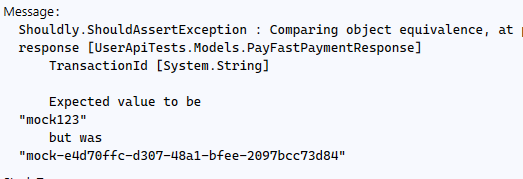

# Introduction to Shouldly

We've used the built-in `Assert` from `NUnit` so far, but it lacks some of the things that make our life easier.

**Shouldly** is an assertion library for .NET, designed to make tests cleaner and more readable. It provides a more expressive way of writing assertions in tests, making them clearer and more maintainable. Unlike the traditional **Assert** methods provided by testing frameworks (like NUnit, xUnit, or MSTest), **Shouldly** allows you to write assertions that are both human-readable and detailed in their feedback when a test fails.

## Why Shouldly Over Assert?

1. **Readable and Intuitive Syntax**:
   Shouldly assertions are more natural to read and understand compared to standard `Assert` statements. This helps non-technical stakeholders (such as product owners) easily understand test failures, as the assertions provide descriptive error messages.

2. **Clear and Detailed Failure Messages**:
   Shouldly automatically generates clear, detailed failure messages, which helps to quickly identify what went wrong. In contrast, traditional assertions like `Assert.AreEqual(expected, actual)` tend to give minimal output, making it harder to debug issues.

3. **Better Object Comparisons**:
   When comparing objects, **Shouldly** provides a more intuitive and flexible approach. For instance, it can compare complex objects and provide more useful error messages when the objects are not equal, rather than simply stating that the values are different.

4. **Type-Safe**:
   Shouldly is type-safe, meaning you get compile-time checks for invalid assertions, helping you avoid errors caused by mistyped parameters.

## Example: Simple Assertions

Instead of using the traditional `Assert.AreEqual` or `Assert.IsTrue`, you can use Shouldly for more readable and expressive tests.

- **Traditional Assert**:

```csharp
Assert.AreEqual(5, result);
```

- **Shouldly**:

```csharp
result.ShouldBe(5);
```

In the above example, **ShouldBe(5)** is a more intuitive assertion, as it clearly states the expectation.

## Example: Comparing Objects

One of the main advantages of **Shouldly** is the ability to compare complex objects, providing a better and more detailed error message when objects don’t match.

- **Traditional Assert** (Object comparison):

```csharp
Assert.AreEqual(expectedObject, actualObject);
```

If the objects are not equal, this assertion might fail, but it doesn’t provide much detail on which specific property or field caused the mismatch. It could also fail on comparing nested properties without much context.

- **Shouldly** (Object comparison):

```csharp
expectedObject.ShouldBeEquivalentTo(actualObject);
```

When using **Shouldly**, if the objects do not match, you get a clear and readable message like this:

```plaintext
expectedObject should be actualObject, but was:
Expected: MyObject { Id = 1, Name = 'John', Address = '123 Main Street' }
Actual: MyObject { Id = 2, Name = 'John', Address = '456 Oak Avenue' }

Difference:
- Id: 1 (expected), 2 (actual)
- Address: '123 Main Street' (expected), '456 Oak Avenue' (actual)
```

This output clearly shows you which properties of the object differ, making it much easier to pinpoint the issue.

## Using Shouldly

Install the `Shouldly` package using the Nuget Package Manager.

Update your ProcessPayment test as below:

```csharp

[Test]
public async Task ProcessPayment_ShouldReturnApprovedTransaction()
{
    // Arrange
    var request = new RestRequest("/api/payments", Method.Post)
        .AddJsonBody(new PayFastPaymentRequest
        {
            Amount = 100.00m,
            Currency = "GBP",
            PaymentMethod = "credit-card",
            CardNumber = "4111111111111111",
            ExpiryMonth = "12",
            ExpiryYear = "99",
            Cvv = "123"
        });

    var expectedResponse = new PayFastPaymentResponse()
    {
        TransactionId = "mock123",
        Status = "approved",
        Amount = 100.00m,
        Currency = "GBP",
        Timestamp = DateTime.UtcNow.ToString("o")
    };

    // Act
    var response = await _client.PostAsync<PayFastPaymentResponse>(request);
    
    //Assert
    Assert.NotNull(response);
    response.ShouldBeEquivalentTo(expectedResponse);
}

```


### Test Fails



Oh dear. what's happened here? Well, since we never know the TransactionId, we cannot compare the object properties.

Since this test is very exact, we need to use something a bit different and compare all the properties individually, using `ShouldSatisfyAllConditions`:


```csharp
[Test]
public async Task ProcessPayment_ShouldReturnApprovedTransaction()
{
    // Arrange
    var request = new RestRequest("/api/payments", Method.Post)
        .AddJsonBody(new PayFastPaymentRequest
        {
            Amount = 100.00m,
            Currency = "GBP",
            PaymentMethod = "credit-card",
            CardNumber = "4111111111111111",
            ExpiryMonth = "12",
            ExpiryYear = "99",
            Cvv = "123"
        });

    var expectedResponse = new PayFastPaymentResponse()
    {
        TransactionId = "mock123",
        Status = "approved",
        Amount = 100.00m,
        Currency = "GBP",
        Timestamp = DateTime.UtcNow.ToString("o")
    };

    // Act
    var response = await _client.PostAsync<PayFastPaymentResponse>(request);
    
    //Assert
    Assert.NotNull(response);

    var actualTimestamp = Convert.ToDateTime(response.Timestamp);

    response.ShouldSatisfyAllConditions(
        () => response.TransactionId.ShouldNotBeNullOrEmpty(), 
        () => response.Status.ShouldBe("approved"),
        () => response.Amount.ShouldBe(expectedResponse.Amount),
        () => response.Currency.ShouldBe(expectedResponse.Currency),
        () => actualTimestamp.ShouldBe(Convert.ToDateTime(expectedResponse.Timestamp), TimeSpan.FromSeconds(5))
    );

}
```

---

Okay, the test now passes. And since this is a quite explicit test, that's fine.

However we will often not care about some fields (like the transaction id, or the timestamp), but more about the functionality of key fields.

We don't *really* want to test fields we don't care about, or write some quite lengthy statements. Sometimes we just want to ignore a couple of fields.

We have a few options:

1. Wrap our assertion in its own method or function
2. Write and extension method

---

## Custom Function
Add a new piece of code to you class:

```csharp
private void AssertProcessedPayment(PayFastPaymentResponse response, PayFastPaymentResponse expectedResponse)
{
    var actualTimestamp = Convert.ToDateTime(response.Timestamp);

    response.ShouldSatisfyAllConditions(
        () => response.TransactionId.ShouldNotBeNullOrEmpty(),
        () => response.Status.ShouldBe("approved"),
        () => response.Amount.ShouldBe(expectedResponse.Amount),
        () => response.Currency.ShouldBe(expectedResponse.Currency),
        () => actualTimestamp.ShouldBe(Convert.ToDateTime(expectedResponse.Timestamp), TimeSpan.FromSeconds(5))
    );
}
```
And update you test:

```csharp
// Act
var response = await _client.PostAsync<PayFastPaymentResponse>(request);

//Assert
Assert.NotNull(response);
AssertProcessedPayment(response, expectedResponse);
```

## Extension Method

Create a new folder named `Extensions` and a class named `ShouldlyExtensions.cs`. Within that file replace the class code:

```csharp
public static class ShouldlyExtensions
{
    public static void ShouldBeEquivalentToIgnoring<T>(this T actual, T expected, params string[] propertiesToIgnore)
    {
        // Serialize the expected and actual objects to JSON
        var actualJson = JsonConvert.SerializeObject(actual, Formatting.None, new JsonSerializerSettings
        {
            ContractResolver = new ShouldlyContractResolver(propertiesToIgnore) // Custom resolver to ignore properties
        });
        var expectedJson = JsonConvert.SerializeObject(expected, Formatting.None, new JsonSerializerSettings
        {
            ContractResolver = new ShouldlyContractResolver(propertiesToIgnore) // Same custom resolver for expected
        });

        // Compare the filtered JSON
        actualJson.ShouldBe(expectedJson);
    }
}

public class ShouldlyContractResolver : Newtonsoft.Json.Serialization.DefaultContractResolver
{
    private readonly string[] _propertiesToIgnore;

    public ShouldlyContractResolver(string[] propertiesToIgnore)
    {
        _propertiesToIgnore = propertiesToIgnore;
    }

    // Override the CreateProperty method to filter properties during serialization
    protected override Newtonsoft.Json.Serialization.JsonProperty CreateProperty(MemberInfo member, Newtonsoft.Json.MemberSerialization memberSerialization)
    {
        var property = base.CreateProperty(member, memberSerialization);

        // Ignore properties specified in _propertiesToIgnore
        if (_propertiesToIgnore.Contains(property.PropertyName))
        {
            property.ShouldSerialize = _ => false;  // Don't serialize the ignored properties
        }

        return property;
    }
}
```

Update your test to use the extension:


```csharp
[Test]
public async Task ProcessPayment_ShouldReturnApprovedTransaction()
{
    // Arrange
    var request = new RestRequest("/api/payments", Method.Post)
        .AddJsonBody(new PayFastPaymentRequest
        {
            Amount = 100.00m,
            Currency = "GBP",
            PaymentMethod = "credit-card",
            CardNumber = "4111111111111111",
            ExpiryMonth = "12",
            ExpiryYear = "99",
            Cvv = "123"
        });

    var expectedResponse = new PayFastPaymentResponse()
    {
        TransactionId = "mock123",
        Status = "approved",
        Amount = 100.00m,
        Currency = "GBP",
        Timestamp = DateTime.UtcNow.ToString("o")
    };

    // Act
    var response = await _client.PostAsync<PayFastPaymentResponse>(request);
    
    //Assert
    Assert.NotNull(response);
    response.ShouldBeEquivalentToIgnoring(expectedResponse, "TransactionId", "Timestamp");
}
```

---

## Which to Use?

I have a strong preference for the latter approach as it's reusable - but that doesn't mean the former is without its merits. In the end it depends how often you are going to assert and how flexible you want to be.

---

[>> Authentication](./authentication.md)