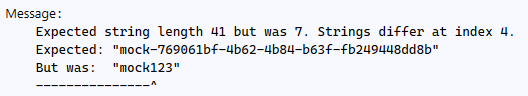

### **Refining Our Stub into a Mock**  

Right now, our `PaymentApiMock` is more of a **stub** in that it always returns the same response regardless of what request it receives. To make it a **mock**, we need to dynamically adjust the response based on the **input payload**.  

---

## **What We Want to Achieve**  
1. **Valid Payments**  
   - If a valid payment request is received, return `200 OK` with an approved transaction.  
2. **Invalid Payments**  
   - If the request is missing required fields (e.g., no card number), return `400 Bad Request`.  
3. **Insufficient Funds Scenario**  
   - If the request contains a specific card number (e.g., `4000000000000002`), return `402 Payment Required`.  

---

## **Updated `PaymentApiMock` with Dynamic Responses**  

```csharp
using Newtonsoft.Json;
using System.Net;
using UserApiTests.Models;
using WireMock.Matchers;
using WireMock.RequestBuilders;
using WireMock.ResponseBuilders;
using WireMock.Server;

namespace UserApiTests.Mocks
{
    public class PaymentApiMock
    {
        private WireMockServer _server;

        public void Start()
        {
            _server = WireMockServer.Start(8080); // Run on localhost:8080

            // Mock dynamic payment processing
            _server.Given(Request.Create()
                    .WithPath("/api/payments")
                    .UsingPost())
                .RespondWith(Response.Create()
                    .WithStatusCode(HttpStatusCode.OK)
                    .WithHeader("Content-Type", "application/json")
                    .WithBody(req =>
                    {
                        var request = JsonConvert.DeserializeObject<PayFastPaymentRequest>(req.Body);
                        return JsonConvert.SerializeObject(new PayFastPaymentResponse
                        {
                            TransactionId = $"mock-{Guid.NewGuid()}",
                            Status = "approved",
                            Amount = request.Amount,
                            Currency = request.Currency,
                            Timestamp = DateTime.UtcNow.ToString("o")
                        });
                    }));


            // Mock insufficient funds scenario
            _server.Given(Request.Create()
                    .WithPath("/api/payments")
                    .UsingPost()
                    .WithBody(new JsonPartialMatcher(JsonConvert.SerializeObject(new
                    {
                        CardNumber = "4000000000000002"
                    }))))
                .RespondWith(Response.Create()
                    .WithStatusCode(HttpStatusCode.PaymentRequired)
                    .WithHeader("Content-Type", "application/json")
                    .WithBodyAsJson(new PayFastErrorResponse() { Error = "Insufficient funds" }));

            // Mock invalid request scenario
            _server.Given(Request.Create()
                    .WithPath("/api/payments")
                    .UsingPost()
                    .WithBody(new JsonPartialMatcher(JsonConvert.SerializeObject(new
                    {
                        CardNumber = ""
                    }))))
                .RespondWith(Response.Create()
                    .WithStatusCode(HttpStatusCode.BadRequest)
                    .WithHeader("Content-Type", "application/json")
                    .WithBodyAsJson(new PayFastErrorResponse() { Error = "Invalid request" }));

            // Mock transaction retrieval
            _server.Given(Request.Create()
                    .WithPath(new RegexMatcher("/api/payments/*"))
                    .UsingGet())
                .RespondWith(Response.Create()
                    .WithStatusCode(HttpStatusCode.OK)
                    .WithHeader("Content-Type", "application/json")
                    .WithBodyAsJson(req =>
                    {
                        var transactionId = req.AbsolutePath.Split('/').Last();
                        return new PayFastTransactionResponse
                        {
                            TransactionId = transactionId,
                            Status = "approved",
                            Amount = 100.00m,
                            Currency = "GBP",
                            Timestamp = DateTime.UtcNow.AddDays(-1).ToString("o")
                        };
                    }));
        }

        public void Stop()
        {
            _server.Stop();
        }

    }
}

```

---

## **What This Achieves**  
- **Mocks real-world payment API behaviour** by dynamically adjusting responses based on request content.  
- **Handles edge cases** like invalid requests and insufficient funds.  
- **No more hardcoded responses**—each request generates a unique `TransactionId`.  
- **Uses `JsonMatcher` to validate request bodies** dynamically.  

---

## **Code Changes**  

This update to the WireMock response logic dynamically generates a payment response based on the request payload instead of returning a fixed response. 

---

### **1. Switching to a Lambda Expression (`req => { ... }`)**  
```csharp
.WithBody(req =>
{
    var request = JsonConvert.DeserializeObject<PayFastPaymentRequest>(req.Body);
    return JsonConvert.SerializeObject(new PayFastPaymentResponse
    {
        TransactionId = $"mock-{Guid.NewGuid()}",
        Status = "approved",
        Amount = request.Amount,
        Currency = request.Currency,
        Timestamp = DateTime.UtcNow.ToString("o")
    });
}));
```
#### **What’s changed?**  
Previously, `.WithBody()` took a **fixed JSON string**. Now, it takes a **lambda expression** `(req => { ... })` to dynamically generate the response body based on the incoming request.

---

### **2. Extracting Data from the Incoming Request**  
```csharp
var request = JsonConvert.DeserializeObject<PayFastPaymentRequest>(req.Body);
```
- `req.Body` contains the **raw JSON request body** sent by the test.  
- `JsonConvert.DeserializeObject<PayFastPaymentRequest>(req.Body)` **converts** this JSON string into a `PayFastPaymentRequest` object, so we can access its properties (like `Amount` and `Currency`).  

---

### **3. Returning a Dynamic Response**  
Instead of always responding with hardcoded values, the mock now **echoes back** the `Amount` and `Currency` sent in the request.  

```csharp
Amount = request.Amount,
Currency = request.Currency,
```
- If the request has `Amount = 50.00` and `Currency = "USD"`, the response will **return the same values**.  
- This makes the mock behave more like a real API, ensuring that the system under test correctly handles different inputs.  

---

### **4. Generating a Unique Transaction ID**  
```csharp
TransactionId = $"mock-{Guid.NewGuid()}",
```
- Instead of always returning `"mock123"`, a **new unique Transaction ID** is generated each time.  
- `Guid.NewGuid()` creates a **random globally unique identifier (UUID)**, ensuring that each test run receives a unique ID.  
- `"mock-"` is prefixed to indicate that this is a mock transaction.  

Example output:  
```json
"TransactionId": "mock-7f9a3b2a-6c41-4f52-9e62-bb3342e4d1c8"
```

---

### **5. Adding a Dynamic Timestamp**  
```csharp
Timestamp = DateTime.UtcNow.ToString("o")
```
- This generates an **ISO 8601 UTC timestamp** reflecting the exact time of the request.  
- `.ToString("o")` ensures it is formatted as a precise, sortable datetime string.  

Example output:  
```json
"Timestamp": "2025-02-14T12:34:56.789Z"
```

---

### **Why Change?**  
1. **More Realistic Mocking** → The response now depends on the request, mimicking real-world API behaviour.  
2. **Prevents Hardcoded Test Dependencies** → Unique Transaction IDs and timestamps avoid collisions in tests.  
3. **Supports Multiple Scenarios** → You can now test how the system reacts to different amounts and currencies.  

### ***Other Changes**

We've also added routes for insufficient funds, an invalid request (no body), and a matcher for all transaction requests.

---

## Update Our Tests 

Of course, now if we run our tests we'll get some bad news - they no longer pass!


### Transaction Test

We can see in the test output the failure is in the dates:


Ah yes, we have changed the date in the transaction to return yesterday's date:

```csharp
return new PayFastTransactionResponse
{
    TransactionId = transactionId,
    Status = "approved",
    Amount = 100.00m,
    Currency = "GBP",
    Timestamp = DateTime.UtcNow.AddDays(-1).ToString("o") //we add -1 days, which is yesterday's date
};
```

So we need to update our test. You might be thinking we just change our date object:

```csharp
Assert.That(Convert.ToDateTime(response.Timestamp), Is.EqualTo(expected: DateTime.Now.AddDays(-1)));
```

However, since we can have tiny fractions of a second in the difference in time of now, it will occasionally fail. Here we want to use something in Wiremock called `Within()` which is an extension method for the DateTime object that we can use to say "any timestamp within 5 seconds of what we expect is fine":

```csharp
Assert.That(Convert.ToDateTime(response.Timestamp), Is.EqualTo(expected: DateTime.Now.AddDays(-1)).Within(5).Seconds);
```

### Process Payment Test

Another error, this time in the format of the transaction Id:



This is because our mock now sends back a string that is "mock-" with a guid:

```csharp
TransactionId = $"mock-{Guid.NewGuid()}",
```

Many people here might go with regex matching to make sure the format is correct, however at the moment we don't know from looking at our specs what it returns, other than it's a string according to the contract.

Since we don't know exactly what the real API responds with apart from the type, we check the type is a string:

```csharp
Assert.That(response.TransactionId, Is.InstanceOf<string>());
```

And remember we also have a timestamp to update:

```csharp
Assert.That(Convert.ToDateTime(response.Timestamp), Is.EqualTo(expected: DateTime.Now).Within(5).Seconds);
```
---

All your tests should now pass!

## Exercise

1. Add test for insufficient fund by using the card number `"4000000000000002"`. 

2. Add a test where the card number is empty.

3. Bonus: Add tests and update your mock for where any mandatory fields are empty or null.

---

[>> Shouldly](./shouldly.md)