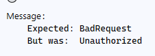

# **Unhappy Path Testing: What, Why, and How?**  

So far, we've focused on **happy path tests**, ensuring that everything works as expected when given valid input. However, real-world systems don’t always behave perfectly—users enter wrong details, the database might be empty, and APIs might return errors. **Unhappy path tests** check how the system behaves when things go wrong.  

In our `LoginUser_ShouldBeSuccessful` test, we assume the user **exists and has the correct password**. But what if:  
- The user **does not exist**?  
- The user enters the **wrong password**?  
- The request **contains invalid data** (e.g., missing fields)?  

---

### **1. User Does Not Exist**  
This tests how the API handles login attempts for **non-existent users**.  

Expected outcome: API should return **401 Unauthorized**.  

```csharp
[Test]
public async Task LoginUser_ShouldFail_WhenUserDoesNotExist()
{
    var nonExistentUser = new User { Name = "NonExistentUser", Password = "WrongPass" };

    var request = new RestRequest(ApiRoutes.Login).AddJsonBody(nonExistentUser);
    var response = await _client.ExecutePostAsync<LoginResponse>(request);

    Assert.That(response.StatusCode, Is.EqualTo(HttpStatusCode.Unauthorized));
    Assert.IsNull(response.Data);
}
```
**Why?** The database does not contain this user, so the API should correctly deny access.  

---

### **2. Incorrect Password**  
What if a user exists but **enters the wrong password**?  

Expected outcome: API should return **401 Unauthorized**.  

```csharp
[Test]
public async Task LoginUser_ShouldFail_WhenPasswordIsIncorrect()
{
    var newUser = UserFactory.CreateUser();
    var createdUser = await _userService.CreateUserAsync(newUser);

    // Modify the password to be incorrect
    var request = new RestRequest(ApiRoutes.Login).AddJsonBody(new User 
    { 
        Name = createdUser.Name, 
        Password = "WrongPassword123" 
    });
    
    var response = await _client.ExecutePostAsync<LoginResponse>(request);

    Assert.That(response.StatusCode, Is.EqualTo(HttpStatusCode.Unauthorized));
    Assert.IsNull(response.Data);

    await _userService.DeleteUserAsync(createdUser.Id);
}
```
**Why?** The username is valid, but the password is wrong, so login should fail.  

---

### **3. Missing Fields (Invalid Request Body)**  
What if a client sends a request **without a username or password**?  

Expected outcome: API should return **400 Bad Request**.  

```csharp
[Test]
public async Task LoginUser_ShouldFail_WhenRequestBodyIsInvalid()
{
    var invalidUser = new User { Name = "", Password = "" }; // Empty fields

    var request = new RestRequest(ApiRoutes.Login).AddJsonBody(invalidUser);
    var response = await _client.ExecutePostAsync<LoginResponse>(request);

    Assert.That(response.StatusCode, Is.EqualTo(HttpStatusCode.BadRequest));
}
```
**Why?** The API should validate input and reject requests with missing or empty fields.  

---

## Run The Tests

You were expecting them to pass? Oh dear.

### `LoginUser_ShouldFail_WhenUserDoesNotExist`

The line `Assert.IsNull(response.Data);` fails because RestSharp deserializes the response to a default instance of `LoginResponse`, which has an Id of `0`. Beware of this. Instead we should check that the response is not successful:

```cs
//Assert.IsNull(response.Data);
Assert.That(response.IsSuccessful, Is.EqualTo(false));
```

### LoginUser_ShouldFail_WhenPasswordIsIncorrect

The line `Assert.IsNull(response.Data);` fails because RestSharp deserializes the response to a default instance of `LoginResponse`, which has an Id of `0`. Beware of this. Instead we should check that the response is not successful:

```cs
//Assert.IsNull(response.Data);
Assert.That(response.IsSuccessful, Is.EqualTo(false));
```

### LoginUser_ShouldFail_WhenRequestBodyIsInvalid

When we look at the error here, we can see what we got bach was not what we expected:



Let's assume out test is correct, and our API is incorrect. Time to update our API to validate the name and password sent to it!

#### `UsersController` Update

```cs
[HttpPost("login")]
public async Task<IActionResult> LoginUser(User user)
{
    // Validate user input: check if Name or Password is null or empty
    if (string.IsNullOrWhiteSpace(user.Name) || string.IsNullOrWhiteSpace(user.Password))
    {
        return BadRequest(new { message = "Name and/or Password cannot be empty." });
    }

    var valid = _context.Users.Where(x => x.Name == user.Name && x.Password == user.Password).FirstOrDefault();
    if (valid == null)
    {
        return Unauthorized();
    }

    return Ok(new { id = valid.Id });
}
```

#### `LoginUser_ShouldFail_WhenRequestBodyIsInvalid` Update

```cs
[Test]
public async Task LoginUser_ShouldFail_WhenRequestBodyIsInvalid()
{
    var invalidUser = new User { Name = "", Password = "" }; // Empty fields

    var request = new RestRequest(ApiRoutes.Login).AddJsonBody(invalidUser);
    var response = await _client.ExecutePostAsync<LoginResponse>(request);

    // Assert: Ensure that the response status code is BadRequest
    Assert.That(response.StatusCode, Is.EqualTo(HttpStatusCode.BadRequest));

    // Assert: Check if the message in the response is as expected
    var responseContent = response.Content;
    dynamic errorResponse = JsonConvert.DeserializeObject(responseContent);
    Assert.That(errorResponse.message.ToString(), Is.EqualTo("Name and/or Password cannot be empty."));
}
```

> :exclamation: Note here we are use what is known as a dynamic object. This is fine for now, but I'd encourage you to update the API so you return default Error objects rather than  the way it's done now, so it can be deserialized correctly.

---

### Happy vs Unhappy  
- **Happy Path**: Tests what **should** happen (valid user logs in).  
- **Unhappy Paths**: Test **what can go wrong** (invalid user, wrong password, bad request).  
- **Why?** Unhappy path tests make APIs **more robust** by ensuring they handle failure cases correctly.  
