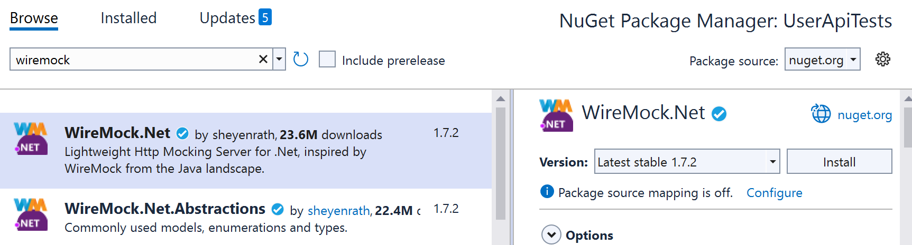

# **Creating a Mock API**  

Now that we've seen the **PayFast API contract**, it's time for us to create a **mock API**. The goal of this mock is to simulate the behaviour of the real API so we can test our integration without needing access to the live system.  

There are a couple of options available:

1. **Use a library like WireMock.NET** – An HTTP server mock that can intercept requests and return predefined responses.  
2. **A Custom In-Memory Server** – Using ASP.NET Core to create a lightweight local API that mimics PayFast.  

We're going to use WireMock.NET, rather than create a whole other API (but I'd encourage you to look into it!)

---

## Model Classes

First off, we need to model our data based on the PayFast contract. Looking at the POST request for a payment:

 ```json
  {
    "amount": 100.00,
    "currency": "GBP",
    "paymentMethod": "credit_card",
    "cardNumber": "4111111111111111",
    "expiryMonth": "12",
    "expiryYear": "2026",
    "cvv": "123"
  }
  ```

We can model that as the following class:

```csharp
//PayFastPaymentRequest.cs
public class PayFastPaymentRequest
{
    public decimal Amount { get; set; }
    public string Currency { get; set; }
    public string PaymentMethod { get; set; }   
    public string CardNumber { get; set; }
    public string ExpiryMonth { get; set; }
    public string ExpiryYear { get; set; }
    public string Cvv { get; set; }
}
```


Doing the same for the response for payment and transaction, as well as for error means we create three more classes:

```csharp
//PayFastPaymentResponse.cs
public class PayFastPaymentResponse
{
    public string TransactionId { get; set; }
    public string Status { get; set; }
    public decimal Amount { get; set; }
    public string Currency { get; set; }
    public string Timestamp { get; set; }
}

//PayFastTransactionResponse.cs
public class PayFastTransactionResponse
{
    public string TransactionId { get; set; }
    public string Status { get; set; }
    public decimal Amount { get; set; }
    public string Currency { get; set; }
    public DateTime Timestamp { get; set; }
}

//PayFastErrorResponse.cs
public class PayFastErrorResponse
{
    public string Error {  get; set; }
}

```

## **Using WireMock.NET**  

[WireMock.NET](https://github.com/WireMock-Net/WireMock.Net) is a .NET version of WireMock, allowing us to define mock HTTP endpoints easily.

### **Installing WireMock.NET**  
Add the WireMock.NET NuGet package to your test project:  

1. **Right-click** the project in **Solution Explorer**  
2. Select **"Manage NuGet Packages"**  
3. Search for Wiremock.net and install it:  



### **Creating a New test Class**

First of all, we want to add a new class for testing this API.

1. **Right-click** the project in **Solution Explorer**  
2. Select **Add** and **New Item**
3. Select **Nunit 3 Test Item**
4. Name the class **PayFastAPITests.cs**

### **Setting Up a Mock Server**  

1. Create a new folder called `Mocks`
2. Add a new class to the folder called `PaymentApiMock.cs`

Now we create a mock API that responds just like PayFast:

```csharp
using Newtonsoft.Json;
using System.Net;
using UserApiTests.Models;
using WireMock.RequestBuilders;
using WireMock.ResponseBuilders;
using WireMock.Server;

namespace UserApiTests.Mocks
{
    public class PaymentApiMock
    {
        private WireMockServer _server;

        public void Start()
        {
            _server = WireMockServer.Start(8080); // Run on localhost:8080

            // Mock payment processing
            _server.Given(Request.Create()
                    .WithPath("/api/payments")
                    .UsingPost())
                .RespondWith(Response.Create()
                    .WithStatusCode(HttpStatusCode.OK)
                    .WithHeader("Content-Type", "application/json")
                    .WithBody(JsonConvert.SerializeObject(new PayFastPaymentResponse()
                    {
                        TransactionId = "mock123",
                        Status = "approved",
                        Amount = 100.00m,
                        Currency = "GBP",
                        Timestamp = "2025-02-14T12:00:00Z"
                    })));

            // Mock transaction retrieval
            _server.Given(Request.Create()
                    .WithPath("/api/payments/mock123")
                    .UsingGet())
                .RespondWith(Response.Create()
                    .WithStatusCode(HttpStatusCode.OK)
                    .WithBody(JsonConvert.SerializeObject(new PayFastTransactionResponse()
                    {
                        TransactionId = "mock123",
                        Status = "approved",
                        Amount = 100.00m,
                        Currency = "GBP",
                        Timestamp = "2025-02-14T12:00:00Z"
                    })));
        }

        public void Stop()
        {
            _server.Stop();
        }
    }
}
```

---

#### **How WireMock Works**  

WireMock allows us to create a **mock API** that behaves like a real service. It intercepts HTTP requests and returns predefined responses, simulating an actual API without requiring a live external service. This is useful for **integration testing**, where we need predictable API behaviour without relying on an unstable or unavailable third-party service.  

Looking at the code, let's take a look at how it works, step-by-step. 

---

##### **1. Defining the Request**  

```csharp
_server.Given(Request.Create()
        .WithPath("/api/payments")
        .UsingPost())
```
This defines the expected **incoming request** to the mock server.  

- `.Given(Request.Create())` → Defines that a new request rule is being created.  
- `.WithPath("/api/payments")` → Specifies that the mock server should respond **only** to requests targeting the `/api/payments` endpoint.  
- `.UsingPost()` → Ensures that the rule only applies to HTTP **POST** requests.  

Essentially, this means:  
_"If a `POST` request is made to `/api/payments`, return a specific response."_  

---

##### **2. Configuring the Response**  

```csharp
.RespondWith(Response.Create()
    .WithStatusCode(HttpStatusCode.OK)
    .WithHeader("Content-Type", "application/json")
    .WithBody(JsonConvert.SerializeObject(new PayFastPaymentResponse()
    {
        TransactionId = "mock123",
        Status = "approved",
        Amount = 100.00m,
        Currency = "GBP",
        Timestamp = "2025-02-14T12:00:00Z"
    }))));
```
This **defines the response** that WireMock should return when the above request is received.  

- `.WithStatusCode(HttpStatusCode.OK)` → Returns HTTP **200 OK**, indicating success.  
- `.WithHeader("Content-Type", "application/json")` → Sets the `Content-Type` header to JSON, ensuring the response format is correct.  
- `.WithBody(JsonConvert.SerializeObject(...))` → Returns a **predefined JSON response** with mock payment details.  

This makes sure that when a test makes a `POST` request to `/api/payments`, the mock API **always** returns:  
```json
{
    "TransactionId": "mock123",
    "Status": "approved",
    "Amount": 100.00,
    "Currency": "GBP",
    "Timestamp": "2025-02-14T12:00:00Z"
}
```
---

##### **3. Understanding the HTTP Request-Response Paradigm**  

This mock follows the standard HTTP request-response interaction model.  

1. **Client Sends a Request**  
   - The test (client) sends an HTTP `POST` request to `/api/payments`.  
   - It expects the payment service to process the request and return a response.  

2. **WireMock Intercepts the Request**  
   - Instead of calling a real payment provider, WireMock matches the request against predefined rules.  
   - Since we’ve set up WireMock to handle `POST /api/payments`, it **does not contact a real service**.  

3. **WireMock Returns the Mocked Response**  
   - WireMock sends back the **predefined** JSON response, ensuring consistent test behaviour.  
   - The test verifies the response, checking if the returned payment details match expectations.  

---

## **Using the Mock in Tests**  

payment provider, we need to write tests that confirm our system interacts with it correctly.

### **1. Initialising the WireMock Server in Tests**
Since we’re testing against an external API (even if it's a mock), we must ensure our WireMock server starts and stops properly.

```csharp
[TestFixture]
public class PayFastApiTests
{
    private PaymentApiMock _mockServer;
    private RestClient _client;

    [OneTimeSetUp]
    public void OneTimeSetUp()
    {
        _mockServer = new PaymentApiMock();
        _mockServer.Start();
        _client = new RestClient("http://localhost:8080");
    }

    [OneTimeTearDown]
    public void OneTimeTearDown()
    {
        _client.Dispose();
        _mockServer.Stop();
    }
}
```

Here, we:
- Start WireMock **once** for all tests using `[OneTimeSetUp]`
- Stop it after all tests complete using `[OneTimeTearDown]`
- Set up `RestClient` to point at our mock API

---

### **2. Writing a Test for Payment Processing**
Now, we test that our system correctly interacts with the mock payment API.

```csharp
[Test]
public async Task ProcessPayment_ShouldReturnApprovedTransaction()
{
    // Arrange
    var request = new RestRequest("/api/payments", Method.Post)
        .AddJsonBody(new PayFastPaymentRequest
        {
            Amount = 100.00m,
            Currency = "GBP",
            PaymentMethod = "credit-card",
            CardNumber = "4111111111111111",
            ExpiryMonth = "12",
            ExpiryYear = "99",
            Cvv = "123"
        });

    var expectedResponse = new PayFastPaymentResponse()
    {
        TransactionId = "mock123",
        Status = "approved",
        Amount = 100.00m,
        Currency = "GBP",
        Timestamp = "2025-02-14T12:00:00Z"
    };

    // Act
    var response = await _client.PostAsync<PayFastPaymentResponse>(request);

    // Assert
    Assert.NotNull(response);
    Assert.That(expectedResponse.TransactionId, Is.EqualTo(response.TransactionId));
    Assert.That(expectedResponse.Status, Is.EqualTo(response.Status));
    Assert.That(expectedResponse.Amount, Is.EqualTo(response.Amount));
    Assert.That(expectedResponse.Currency, Is.EqualTo(response.Currency));
    Assert.That(expectedResponse.Timestamp, Is.EqualTo(response.Timestamp));
}
```

---

### **3. Writing a Test for Transaction Retrieval**
We now verify that retrieving a transaction returns the expected data.

```csharp
[Test]
public async Task GetTransaction_ShouldReturnTransactionDetails()
{
    // Arrange
    var request = new RestRequest("/api/payments/mock123", Method.Get);

    var expectedResponse = new PayFastTransactionResponse()
    {
        Amount = 100.00m,
        Currency = "GBP",
        Status = "approved",
        Timestamp = "2025-02-14T12:00:00Z",
        TransactionId = "mock123"
    };

    // Act
    var response = await _client.GetAsync<PayFastTransactionResponse>(request);

    // Assert
    Assert.NotNull(response);
    Assert.That(response.TransactionId, Is.EqualTo(expectedResponse.TransactionId));
    Assert.That(response.Status, Is.EqualTo(expectedResponse.Status));
    Assert.That(response.Amount, Is.EqualTo(expectedResponse.Amount));
    Assert.That(response.Currency, Is.EqualTo(expectedResponse.Currency));
    Assert.That(response.Timestamp, Is.EqualTo(expectedResponse.Timestamp));
}
```

Run your tests to make sure that they pass!

---
[>> Test Doubles](./testdoublesandenv.md)


